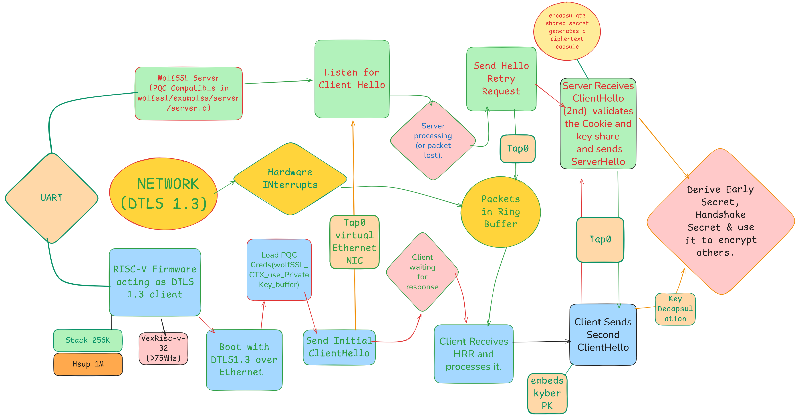
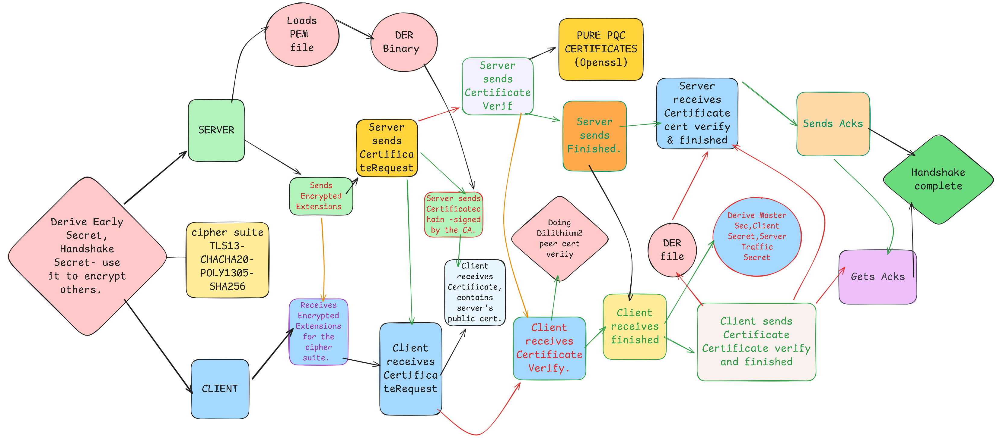
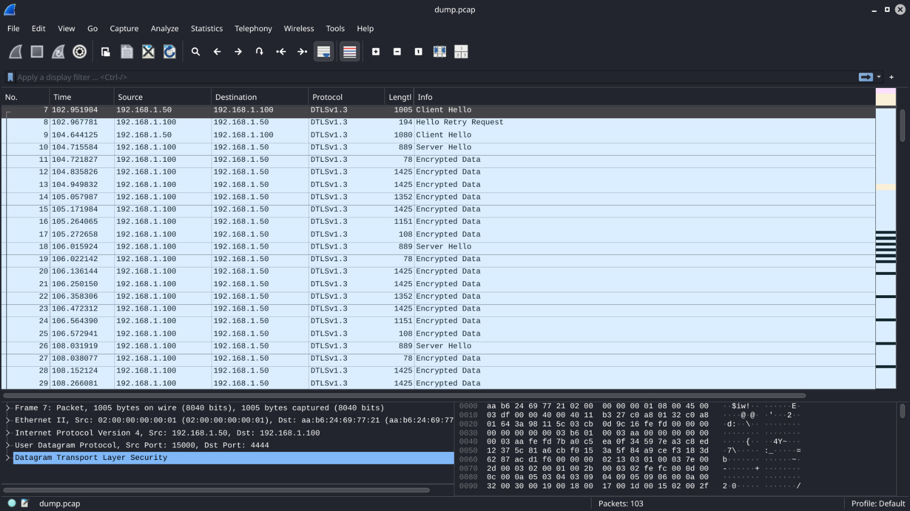

[](LICENSE)
[]()
[](https://drive.google.com/file/d/1E9gbMNrSTL7WNWUvcyx_RmMLJP29DdQH/view?usp=sharing)
[](https://drive.google.com/file/d/1GhtpFJ6wpb3meYf1uiJ_hL0hbMshxEvS/view?usp=sharing)

# PQC-DTLS on Bare-Metal RISC-V — Post-Quantum DTLS 1.3 
## Introduction
Secure communication for constrained IoT devices must remain robust even against future quantum adversaries.
This project implements a PQC-enabled DTLS 1.3 stack on a bare-metal RISC-V client (VexRiscv), simulated using LiteX and Verilator.

It integrates Kyber (KEM) and Dilithium (signatures) into a minimized wolfSSL-based DTLS stack and validates end-to-end communication with a host-side server. The networking layer replaces polling with an interrupt-driven Ethernet ISR and an RX ring buffer to prevent packet loss during computationally intensive PQC operations. The firmware includes cycle-accurate latency measurement (rdcycle CSR), heap profiling, and systematic compiler and cipher-suite optimizations (e.g., ChaCha20-Poly1305) to balance memory footprint, handshake latency, and throughput. The repository provides full toolchain automation, certificate generation, simulation setup, benchmark instrumentation, demo logs, and packet captures to ensure reproducibility.

This solution was developed for the [QTrino Labs problem statement](https://drive.google.com/file/d/17WdoZTA7-rwXUIRJVGoSy-bnlKaQr2N3/view?usp=sharing) and was awarded the Gold prize at Inter IIT Tech Meet 14.0.

---

## Table of Contents

- [Introduction](#introduction)
- [Quickstart](#quickstart)
- [Build & Setup: (How to Compile the RISC-V Firmware)](#build--setup-how-to-compile-the-risc-v-firmware)
  - [Method 1: One-Shot Setup](#method-1-one-shot-setup)
  - [Method 2: Incremental Steps](#method-2-incremental-steps)
- [How to Run on LiteX + Verilator](#how-to-run-on-litex--verilator)
- [How to Start DTLS Server](#how-to-start-dtls-server)
- [Directory Structure Explanation](#directory-structure-explanation)
- [Network Monitoring](#network-monitoring)
- [Full Architecture](#full-architecture)
- [Demo](#demo)
- [Performance Metrics](#performance-metrics-100-mhz-simulation-post-optimization)
- [Troubleshooting](#troubleshooting)
- [Optimization](#optimization)
- [Report](#report)
- [Presentation](#presentation)
- [Resources](#resources)


---
## Quickstart

```bash
./setup.sh
./scripts/server.sh
./scripts/client.sh
```

## Build & Setup: (How to Compile the RISC-V Firmware)

The project provides a **master script** to automate the entire environment setup, toolchain installation, and compilation. Alternatively, scripts can be run individually for granular control.

**Toolchain Requirements:**
*   **RISC-V Toolchain:** `gcc-riscv64-unknown-elf`, `riscv64-binutils`
*   **Simulation Tools:** `Verilator`, `libevent-dev`, `libjson-c-dev`
*   **Build Systems:** `Make`, `Meson`, `Ninja`, `Python3`, `git`
*   **Cert generation:** `openssl`, `liboqs`, `oqs-provider`
*   **OS:** Ubuntu Linux (or any other Debian derivative)

### Method 1: One-Shot Setup
The script `setup.sh` runs the entire initialization process. It installs dependencies, sets up the network, builds the host server, and compiles the RISC-V firmware.

**Command:**
```bash
$ ./setup.sh
```
*Note: You will be prompted for your `sudo` password to install system packages and configure the network TAP interface.*

### Method 2: Incremental Steps

If you prefer to run the steps manually or need to debug a specific stage, execute the scripts in the following order:

1.  **Environment and Toolchain Setup:**
    Installs RISC-V GCC, Verilator, creates the Python virtual environment (`litex-env`), and installs LiteX.
    ```bash
    ./scripts/litex-setup.sh
    ```

2.  **Host Crypto Tools Setup:**
    Builds `liboqs` and `oqs-provider` (required for generating PQC cert/keys used by the firmware and server).
    ```bash
    ./scripts/openssl-setup.sh
    ```

3.  **Network Configuration:**
    Creates the `tap0` virtual interface and sets traffic control rules.
    ```bash
    ./scripts/net-setup.sh
    ```

4.  **Generate Simulation Build Files:**
    Runs the LiteX simulator to generate necessary Verilator build artifacts/headers.
    ```bash
    ./scripts/gen-sim-files.sh
    ```

5.  **Build Host Server:**
    Clones and compiles the WolfSSL library on host for example server with PQC enabled.
    ```bash
    ./scripts/build-server.sh
    ```

6.  **Compile Firmware:**
    Compile the RISC-V firmware binary.
    ```bash
    make
    ```

**Expected Output Binaries:**
After running `setup.sh` or `make`, the following files will be generated:
*   `boot.bin`: The raw binary image loaded into the simulator's RAM.
*   `boot.fbi`: Flash Boot Image.
*   `boot.elf`: The Executable and Linkable Format file (for debugging).

> Note: Any changes in source files (in boot/), requires
> ```bash
> $ make
> ```
> to be run after change for rebuilding `boot.bin`.

## How to Run on LiteX + Verilator

The project uses `litex_sim` to simulate a VexRiscv SoC.

**Network Configuration:**
Before running the simulation, the network TAP interface must be configured to allow communication between the host (server) and the simulation (client).
```bash
# Sets up tap0 with IP 192.168.1.100 with a traffic limit
$ ./scripts/net-setup.sh
```

**Verilator Simulation Command:**
To run the simulation with the compiled firmware, use the provided client script:
```bash
$ ./scripts/client.sh
...
# Runs:
# litex_sim --csr-json csr.json \
#           --cpu-type=vexriscv \
#           --cpu-variant=full \
#           --integrated-main-ram-size=0x06400000 \
#           --ram-init=boot.bin \
#           --with-ethernet \
#           --sys-clk-freq 100000000
```
**Configuration Values:**
The `client.sh` script executes `litex_sim` with the following specific parameters:
*   **CPU:** VexRiscv (Variant: Full)
*   **Memory:** 0x06400000 (100 MB Integrated Main RAM)
*   **Clock:** 100 MHz (by new `--sys-clk-freq` argument)
*   **Network:** Ethernet enabled (`--with-ethernet`)
*   **Firmware:** Loaded via `--ram-init=boot.bin`
---

## How to Start DTLS Server

The host-side server acts as the endpoint for the RISC-V client. It is a custom build of WolfSSL supporting PQC.

**Server Binaries & Scripts:**
*   **Build Script:** `scripts/build-server.sh` (Clones WolfSSL stable, configures with Kyber/Dilithium/DTLS1.3, and compiles).
*   **Run Script:** `scripts/server.sh`.
*   **Binary Location:** `wolfssl/examples/server/server`.

**WolfSSL/WolfCrypt Configuration:**
The host server is configured with the following flags:
`--enable-dtls --enable-dtls13 --enable-kyber --enable-dilithium --enable-dtls-frag-ch --enable-ipv6=no`

**Steps to Reproduce the Handshake:**
1.  **Start the Server:**
    Open a terminal and run:
    ```bash
    $ ./scripts/server.sh
    ...
    # Runs:
    # ./examples/server/server -u -v 4 -p 4444 \
    #                 --pqc ML_KEM_512 \
    #                 -k ../boot/certs/server.key.pem \
    #                 -c ../boot/certs/server.pem -d
    ```
    *Expected IP/Port:* Listens on `UDP` port `4444`. The script binds to all interfaces, and the client communicates via the `tap0` network (Host IP: 192.168.1.100).

2.  **Start the Client:**
    In a separate terminal (with `tap0` setup), run:
    ```bash
    $ ./scripts/client.sh
    ```

3.  **Observation:**
    The server terminal will show the cipher suite, PQC details and the received client message.
    The client terminal will output latencies, memory profiling data, throughput and efficiency metrics.

---

## Directory Structure Explanation

```
.
├── boot/                       # RISC-V Firmware Source
│   ├── certs/
│   │   ├── gen-certs.sh        # Script to generate MLDSA44/Dilithium certs
│   │   ├── CA.pem / .key       # Certificate Authority
│   │   ├── client.*            # Client Certificate & Private Key
│   │   └── server.*            # Server Certificate & Private Key
│   ├── src/
│   │   ├── internal.c          # Modified WolfSSL internal file (Verification metrics)
│   │   └── ...                 # Standard embedded WolfSSL source
│   ├── wolfssl/
│   │   └── wolfcrypt/
│   │       ├── user_settings.h # CRITICAL: Config for PQC, Math, & Memory
│   │       └── ...             # Remaining Config files 
│   ├── linker.ld               # RISC-V Linker Script (Memory Layout)
│   ├── main.c                  # Main Firmware Logic & State Machine
│   ├── mem_profile.c/.h        # Custom Heap Profiling Instrumentation
│   ├── Makefile                # Firmware compilation rules
│   └── boot.bin                # Final Compiled Binary
├── build/                      # LiteX Build Artifacts
│   └── sim/
│       ├── csr.csv             # CSR Register Map (CSV format)
│       ├── gateware/           # Generated Verilog/Verilator files
│       └── software/           # Generated BIOS and SoC headers
├── scripts/                    # Automation Scripts
│   ├── build-server.sh         # Clones & Builds Host WolfSSL Server
│   ├── client.sh               # Launcher: LiteX Simulator (Client)
│   ├── gen-sim-files.sh        # Generator: Simulation Hardware
│   ├── litex-setup.sh          # Setup: RISC-V GCC & LiteX Env
│   ├── net-setup.sh            # Setup: tap0 Network Interface
│   ├── openssl-setup.sh        # Setup: OQS-OpenSSL for PQC Certs
│   └── server.sh               # Launcher: Host WolfSSL Server
├── wolfssl/                    # Host WolfSSL Directory (Cloned)
│   └── examples/
│       └── server/
│           ├── server          # Compiled Host Server Binary
│           └── ...             # Server files
├── csr.json                    # Control Status Register Map (JSON)
├── litex_setup.py              # LiteX SoC Generator Script
├── Makefile                    # Root Wrapper Makefile
└── setup.sh                    # Master One-Shot Initialization Script
```

Modified and new files/directories:

*   **/ (Root)**
    *   `setup.sh`: Master initialization script. Calls sub-scripts to setup toolchains, network, and libraries.
    *   `Makefile`: Wrapper makefile that invokes the Makefile in `/boot`.

*   **/scripts/**
    *   Contains helper bash scripts for modular setup.
    *   `litex-setup.sh`: Installs RISC-V GCC, Verilator, and LiteX Python env.
    *   `openssl-setup.sh`: Builds OpenSSL and liboqs (required for generating PQC certificates).
    *   `net-setup.sh`: Configures the `tap0` network interface and traffic control.
    *   `build-server.sh`: Configures and builds wolfssl on host for example server.
    *   `client.sh` / `server.sh`: Launchers for the simulation and host server.

*   **/boot/**
    *   Contains the source code for the RISC-V firmware.
    *   **`main.c`**: Initializes RISC-V hardware and executes the WolfSSL DTLS 1.3 client with ML-KEM PQC. It implements an RX ring buffer for asynchronous UDP handling and includes instrumentation to measure handshake latency, memory usage, and encryption throughput.
    *   **`Makefile`**: Main build rules. Handles `boot.bin` generation and certificate creation.
    *   `mem_profile.h/.c`: Custom heap profiling functions used in `main.c`.
    *   `src/internal.c`: Modified to extract certificate verification latencies.
    *   **`linker.ld`**: Size of stack/heap.

*   **/boot/certs/**
    *   `gen_certs.sh`: Script to generate MLDSA44 (Dilithium2) keys and certificates.
    *   Stores the generated `.pem`, `.der`, and `.key` files used by both Client and Server.

*   **/boot/wolfssl/**
    *   The embedded version of the WolfSSL library linked into the RISC-V firmware.
    *   **`wolfcrypt/user_settings.h`**: Critical configuration file defining the embedded crypto features (e.g., enabling PQC, memory settings).

*   **/wolfssl/** (Created during setup)
    *   The standard WolfSSL library built for the *host* machine (x86_64/Linux) to run the example server.

*   **/litex/** (Created during setup)
    *   Contains the LiteX SoC generator tools.
    *   *Note:* `litex/tools/litex_sim.py` has been modified to accept `--sys-clk-freq`.

### Network Monitoring

Network dump for `tap0` can be obtained by
```bash
$ sudo tcpdump -i tap0 -n -vv -w dump.pcap
```
while the client/server are running.

## Full Architecture

The bare-metal RISC-V firmware (VexRiscv) runs inside a LiteX + Verilator simulated SoC and communicates with a host-side WolfSSL DTLS server via a TAP-based virtual Ethernet interface. The handshake and encrypted communication can be observed through logs and packet captures (Wireshark).




## Demo
### Watch the demo [here](https://drive.google.com/file/d/1GhtpFJ6wpb3meYf1uiJ_hL0hbMshxEvS/view?usp=sharing).

You can also refer to the [client](https://drive.google.com/file/d/1hT5YuR1TBtSRf6FHjgt948c517fZ0of7/view?usp=sharing) and [server logs](https://drive.google.com/file/d/1p7gXRa4ZikHE0p91mM-Oh0COTI8sPdJl/view?usp=sharing).

 

### Performance Metrics (100 MHz Simulation, Post-Optimization)
- DTLS 1.3 Handshake Latency: ~129 ms  
- Peak Heap Usage: ~71 KB  
- ROM Footprint: ~320 KB  
- Post-handshake Throughput: ~98 KB/s  

(See full report for detailed methodology and breakdown.)

### Troubleshooting
See [our report](https://drive.google.com/file/d/1WS31zLKAzv8hEbAL82r3Hy0q4Qn1P_ge/view) for troubleshooting.

### Optimization
See [our report](https://drive.google.com/file/d/1RzjmnQwoQik7tjSrbiXQEQ1EEtdAmovE/view) for optimization.

### Report
- [Final Technical Report (PDF)](https://drive.google.com/file/d/1E9gbMNrSTL7WNWUvcyx_RmMLJP29DdQH/view?usp=sharing)  
  Detailed design, implementation methodology, benchmarking, and optimization analysis.

### Presentation
- [Final Presentation Slides](https://drive.google.com/file/d/1BZ4qxb3dLaaj_fClMu1z2nHJ6MAH235y/view?usp=sharing)  
  Summary of problem context, architecture, key engineering decisions, and results.

- [Presentation Speech Transcript](https://docs.google.com/document/d/1SHqU9SBc4xdzQriFvMwKvgTG4m8U65jbx9xysC6LW7o/edit?usp=sharing)  
  Five-minute walkthrough delivered during the final evaluation.

### NOTE:
The present system can be easily configured for end-to-end communication with a capable server. It can also be configured for multiple-message communication with a capable server.

## RESOURCES
### Constraint_Env_Sim (RISC-V IoT + PQC Environment)
- Official Main Repo — https://github.com/QTrino-Labs-Pvt-Ltd/Constraint_Env_Sim


### 1. TRNG (True Random Number Generator) Resources
- OpenTRNG — https://opentrng.org
- Random.org (Entropy source research) — https://www.random.org
- NeoTRNG (Open-source HDL TRNG) — https://github.com/stnolting/neoTRNG
- OpenTRNG Noisy Ring Oscillator Emulator — https://opentrng.org/docs/emulator#emulate-noisy-ring-oscillators

### 2. Compiler Optimization & Performance Profiling
- GCC Optimization Options — https://gcc.gnu.org/onlinedocs/gcc/Optimize-Options.html
- Brendan Gregg’s perf-tools — https://github.com/brendangregg/perf-tools
- perf-record Manual — https://man7.org/linux/man-pages/man1/perf-record.1.html
- Brendan Gregg’s perf & Dynamic Tracing Examples — https://www.brendangregg.com/perf.html#DynamicTracingEg

### 3. DTLS 1.3 / RFCs / Protocols
- RFC 9147 — DTLS 1.3 Specification  
  https://datatracker.ietf.org/doc/rfc9147/
- OpenSSL DTLS Timer Callback Reference  
  https://docs.openssl.org/1.1.1/man3/DTLS_set_timer_cb/

### 4. wolfSSL / wolfCrypt Integration Resources
- wolfSSL DTLS Example Repository —  
  https://github.com/wolfSSL/wolfssl-examples/tree/master/dtls
- wolfSSL Forums —  
  https://www.wolfssl.com/forums/forum3-wolfssl.html
- wolfSSL Official Manual —  
  https://www.wolfssl.com/documentation/manuals/wolfssl/index.html
- wolfSSL Server Example (Manual Chapter 3) —  
  https://www.wolfssl.com/documentation/manuals/wolfssl/chapter03.html#server-example
- wolfSSL 5.8.4 (complete source archive) —  
  https://fossies.org/linux/misc/wolfssl-5.8.4.zip/

### 5. RISC-V Development & Post-Quantum Crypto Resources
- RISC-V Getting Started Guide —  
  https://risc-v-getting-started-guide.readthedocs.io/en/latest/
- liboqs (Open Quantum Safe PQC Library) —  
  https://github.com/open-quantum-safe/liboqs

### 6. Cryptographic Benchmarking Tools (Used for rd cycle logic buildup)
- SUPERCOP (System for Unified Performance Evaluation Related to Cryptographic Operations and Primitives) —  
  https://bench.cr.yp.to/supercop.html

### 7. RISC-V Emulators
- QEMU (Full-system & user-mode RISC-V emulator) — https://www.qemu.org/

### 8. PQC Learning & Certification Resources
- PQC Documentation (PKI India) —  
  https://learn.pkiindia.in/pqc-documentation.pdf
- OpenSSL PQC Certificates Reference —  
  https://docta.ucm.es/rest/api/core/bitstreams/b9fa8883-6106-41ae-90ff-f36f3c7271e5/content

### 9. Research Papers
- *Optimized Software Implementation of Keccak, Kyber, and Dilithium on RV32/64IMB-V* —  
  https://www.researchgate.net/publication/386739615_Optimized_Software_Implementation_of_Keccak_Kyber_and_Dilithium_on_RV3264IMBV

---

This repository serves as a reference implementation for PQC-secured communication on constrained RISC-V systems and can be extended to real-world IoT, medical, and aerospace deployments.
